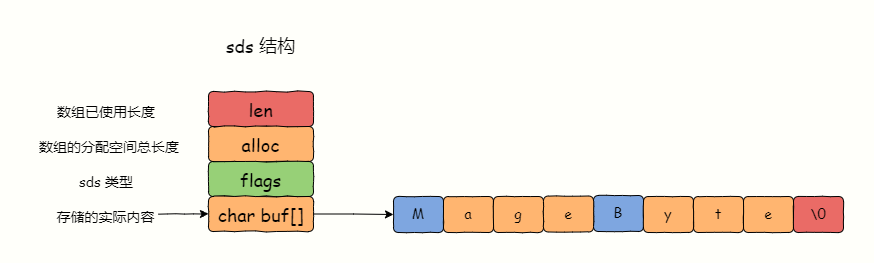
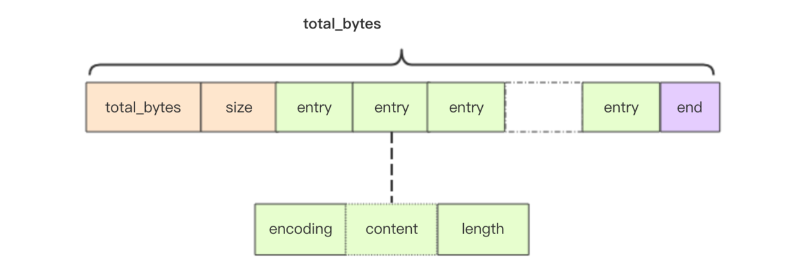
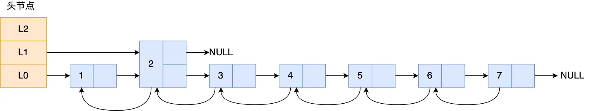
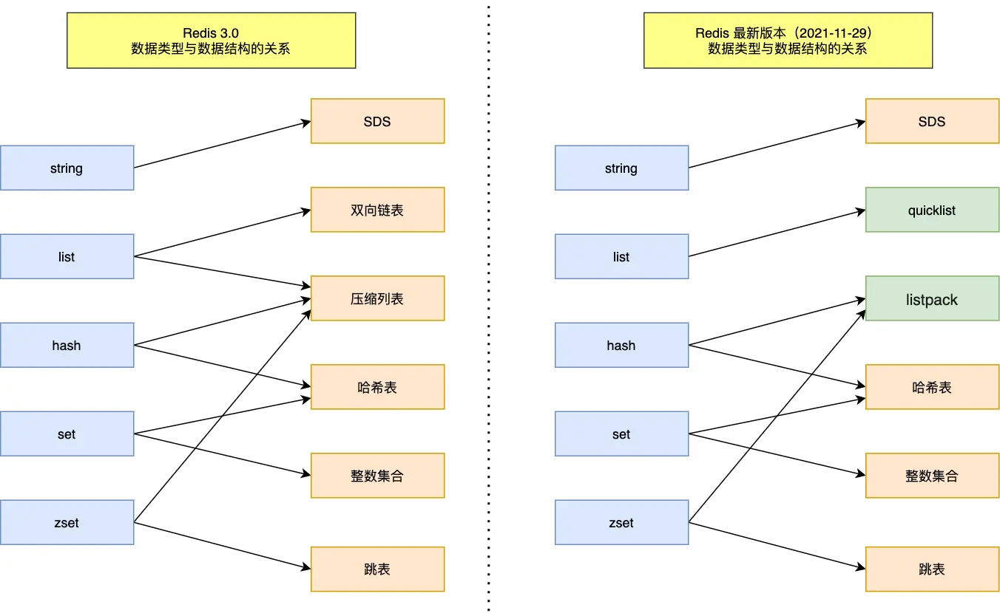

# Redis 基本数据类型和应用场景

## String

### 介绍

String 是最基本的 key-value 结构，key 是唯一标识，value 是具体的值，value 其实不仅是字符串， 也可以是数字（整数或浮点数），value 最多可以容纳的数据长度是 512M。  
String 类型是二进制安全的，意思是 Redis 的 String 可以包含任何数据，比如 jpg 图片或者序列化的对象。

### 内部实现

Redis 的 SDS（Simple Dynamic Strings，简单动态字符串）是一种用于处理字符串的动态数据结构。

- 动态长度: SDS 可以根据存储的内容动态地调整长度，这使得它能够高效地处理不同长度的字符串，而无需事先分配固定大小的内存空间。
- 缓冲区结构: SDS 采用了一种包含字符串内容和额外信息的缓冲区结构。除了存储实际的字符串内容外，还保存了字符串的长度以及当前已分配的内存空间大小等信息。
- 修改操作效率高: SDS 支持在 O(1)时间复杂度内进行字符串尾部的追加、删除、更新等操作，这使得在字符串操作频繁的场景下，SDS 能够提供高效的性能。
- 二进制安全: SDS 中的字符串可以包含任意的二进制数据，而不仅仅局限于文本字符串。这使得 SDS 可以被广泛应用于存储各种类型的数据。因为 SDS 不需要用 “\0” 字符来标识字符串结尾了，而是有个专门的 len 成员变量来记录长度，所以可存储包含 “\0” 的数据。
- 惰性空间释放: SDS 采用惰性空间释放策略，即当字符串缩短时，并不立即释放多余的空间，而是保留一定的额外空间以备将来使用，从而避免了频繁的内存重分配操作。

### 操作

| 命令                            | 介绍                             |
| ------------------------------- | -------------------------------- |
| SET key value                   | 设置指定 key 的值                |
| SETNX key value                 | 只有在 key 不存在时设置 key 的值 |
| GET key                         | 获取指定 key 的值                |
| MSET key1 value1 key2 value2... | 设置一个或多个指定 key 的值      |
| MGET key1 key2...               | 获取一个或多个指定 key 的值      |
| STRLEN key                      | 返回 key 所储存的字符串值的长度  |
| INCR key                        | 将 key 中储存的数字值增一        |
| DECR key                        | 将 key 中储存的数字值减一        |
| EXISTS key                      | 判断指定 key 是否存在            |
| DEL key                         | 删除指定的 key                   |
| EXPIRE key seconds              | 给指定 key 设置过期时间          |

### 应用场景

- 缓存 session、token、序列化后的对象、图片地址
- 限流
- 分布式锁

## List

### 介绍

List 列表是简单的字符串列表，按照插入顺序排序，可以从头部或尾部向 List 列表添加元素。

列表的最大长度为 2^32 - 1，也即每个列表支持超过 40 亿个元素。

### 内部实现

List 类型的底层数据结构是由双向链表或压缩列表实现的。如果列表的元素个数小于 512 （默认值）个，列表每个元素的值都小于 64 字节（默认值），那么 Redis 会使用压缩列表作为列表的底层实现，否则会使用双向链表作为列表的底层实现。

- 压缩列表是一种紧凑的字节数组，它可以存储多个元素，每个元素可以是一个字节数组或一个整数。 虽然压缩列表紧凑型的内存布局能节省内存开销，但是如果保存的元素数量增加了，或是元素变大了，会导致内存重新分配，最糟糕的是会有「连锁更新」的问题。
- 每个节点的 previous_entry_length 属性都记录了前一个节点的长度：如果前一节点的长度小于 254 字节，那么 previous_entry_length 属性需要用 1 字节长的空间来保存这个长度值；如果前一节点的长度大于等于 254 字节，那么 previous_entry_length 属性需要用 5 字节长的空间来保存这个长度值。当一个节点的长度发生变化时，可能会影响到它后面的所有节点的 previous_entry_length 属性的大小。

双向链表是一种线性数据结构，它由多个节点组成，每个节点包含一个值和两个指针，分别指向前一个节点和后一个节点。它的优点是节点修改的效率高，但是需要额外的内存开销，并且节点较多时，会产生大量的内存碎片。

但是在 Redis 3.2 版本之后，List 数据类型底层数据结构就只由 quicklist 实现了，替代了双向链表和压缩列表。  
其实 quicklist 就是双向链表里存压缩列表，一个 quicklist 就是一个链表，而链表中的每个元素又是一个压缩列表。

### 操作

| 命令                    | 介绍                                       |
| ----------------------- | ------------------------------------------ |
| RPUSH key value1 value2 | 在指定列表的尾（右边）添加一个或多个元素   |
| LPUSH key value1 value2 | 在指定列表的头部（左边）添加一个或多个元素 |
| LSET key index value    | 将指定列表索引 index 位置的值设置为 value  |
| LPOP key                | 移除并获取指定列表的第一个元素（最左边）   |
| RPOP key                | 移除并获取指定列表的最后一个元素（最右边） |
| LLEN key                | 获取列表元素数量                           |
| LRANGE key start end    | 获取列表 stat 和 end 之间的元素            |

### 应用场景

- 消息队列 （Redis 5.0 之后支持阻塞式队列） List 可以使用 LPUSH + RPOP （或者反过来，RPUSH+LPOP）命令实现消息队列。
- Redis 提供了 BRPOP 命令。BRPOP 命令也称为阻塞式读取，客户端在没有读到队列数据时，自动阻塞，直到有新的数据写入队列，再开始读取新数据。和消费者程序自己不停地调用 RPOP 命令相比，这种方式能节省 CPU 开销。

## Hash

### 介绍

Hash 是一个 string 类型的 field 和 value 的映射表，hash 特别适合用于存储对象。  
Redis 中每个 hash 可以存储 2^32 - 1 键值对（40 多亿）。

### 内部实现

Hash 类型的底层数据结构是由压缩列表或哈希表实现的。

如果哈希类型元素个数小于 512 个（默认值）所有值小于 64 字节（默认值）的话。
Redis 会使用压缩列表作为 Hash 类型的底层数据结构；如果哈希类型元素不满足上面条件，Redis 会使用哈希表作为 Hash 类型的 底层数据结构。

- Redis 采用了「链式哈希」的方法来解决哈希冲突。
- Redis 在 dict 中定义了 2 个 dictht（hash 表）交替使用，用于 rehash 操作（扩展 hash 表大小，减少 hash 冲突）
- 为了避免 rehash 在数据迁移过程中，因拷贝数据的耗时，影响 Redis 性能的情况，所以 Redis 采用了渐进式 rehash，也就是将数据的迁移的工作不再是一次性迁移完成，而是分多次迁移：在 rehash 进行期间，每次哈希表元素进行新增（新增时只会被保存到「哈希表 2 」里面）、删除、查找或者更新操作时，Redis 除了会执行对应的操作之外，还会顺序将「哈希表 1 」中索引位置上的所有 key-value 迁移到「哈希表 2」 上；

在 Redis 7.0 中，压缩列表数据结构已经废弃了，交由 listpack 数据结构来实现了。  

listpack 头包含两个属性，分别记录了 listpack 总字节数和元素数量，然后 listpack 末尾也有个结尾标识。图中的 listpack entry 就是 listpack 的节点了。  
listpack 没有压缩列表中记录前一个节点长度的字段了，listpack 只记录当前节点的长度，当我们向 listpack 加入一个新元素的时候，不会影响其他节点的长度字段的变化，从而避免了压缩列表的连锁更新问题。

### 操作

| 命令                                  | 介绍                                                    |
| ------------------------------------- | ------------------------------------------------------- |
| HSET key field value                  | 设置指定哈希表中指定字段的值                            |
| HSETNX key field value                | 只有指定字段不存在时设置指定字段的值                    |
| HMSET key field1 value1 field2 value2 | 同时将一个或多个 field-value(域-值)对设置到指定哈希表中 |
| HGET key field                        | 获取指定哈希表中指定字段的值                            |
| HMGET key field1 field2...            | 获取指定哈希表中一个或者多个指定字段的值                |
| HGETALL key                           | 获取指定哈希表中所有的键值对                            |
| HEXISTS key field                     | 查看指定哈希表中指定的字段是否存在                      |
| HDEL key field1 field2...             | 删除一个或多个哈希表字段                                |
| HLEN key                              | 获取指定哈希表中字段的数量                              |
| HINCRBY key field increment           | 对指定哈希中的指定字段做运算操作（正数为加，负数为减）  |

### 应用场景

- 缓存对象
- 购物车

## Set

### 介绍

Set 类型是一个无序并唯一的键值集合，它的存储顺序不会按照插入的先后顺序进行存储。

### 内部实现

Set 类型的底层数据结构是由哈希表或整数集合实现的：

如果集合中的元素都是整数且元素个数小于 512 （默认值）个，Redis 会使用整数集合作为 Set 类型的底层数据结构。

- 当一个 Set 对象只包含整数值元素，并且元素数量不大时，就会使用整数集这个数据结构作为底层实现。整数集合本质上是一块连续内存空间

如果集合中的元素不满足上面条件，则 Redis 使用哈希表作为 Set 类型的底层数据结构。

### 操作

| 命令                                 | 介绍                                      |
| ------------------------------------ | ----------------------------------------- |
| SADD key member1 member2...          | 向指定集合添加一个或多个元素              |
| SMEMBERS key                         | 获取指定集合中的所有元素                  |
| SCARD key                            | 获取指定集合的元素数量                    |
| SISMEMBER key member                 | 判断指定元素是否在指定集合中              |
| SINTER key1 key2...                  | 获取给定所有集合的交集                    |
| SINTERSTORE destination key1 key2... | 将给定所有集合的交集存储在 destination 中 |
| SUNION key1 key2...                  | 获取给定所有集合的并集                    |
| SUNIONSTORE destination key1 key2... | 将给定所有集合的并集存储在 destination 中 |
| SDIFF key1 key2...                   | 获取给定所有集合的差集                    |
| SDIFFSTORE destination key1 key2...  | 将给定所有集合的差集存储在 destination 中 |
| SPOP key count                       | 随机移除并获取指定集合中一个或多个元素    |
| SRANDMEMBER key count                | 随机获取指定集合中指定数量的元素          |

### 应用场景

- 共同好友
- 点赞

## Sorted Set(Zset)

Zset 类型（Sorted Set，有序集合） 可以根据元素的权重来排序，我们可以自己来决定每个元素的权重值。比如说，我们可以根据元素插入 Sorted Set 的时间确定权重值，先插入的元素权重小，后插入的元素权重大。

### 内部实现

Zset 类型的底层数据结构是由压缩列表或跳表实现的：
如果有序集合的元素个数小于 128 个，并且每个元素的值小于 64 字节时，Redis 会使用压缩列表作为 Zset 类型的底层数据结构；  
如果有序集合的元素不满足上面的条件，Redis 会使用跳表作为 Zset 类型的底层数据结构；

- 链表在查找元素的时候，因为需要逐一查找，所以查询效率非常低，时间复杂度是 O(N)，于是就出现了跳表。跳表是在链表基础上改进过来的，实现了一种「多层」的有序链表，
- 为什么用跳表而不用平衡树？
  1. 从内存占用上来比较，跳表比平衡树更灵活一些。平衡树每个节点包含 2 个指针（分别指向左右子树），而跳表每个节点包含的指针数目平均为 1/(1-p)，具体取决于参数 p 的大小。
  2. 在做范围查找的时候，跳表比平衡树操作要简单。
  3. 从算法实现难度上来比较，跳表比平衡树要简单得多。

在 Redis 7.0 中，压缩列表数据结构已经废弃了，交由 listpack 数据结构来实现了。

### 操作

| 命令                                         | 介绍                                                                                                          |
| -------------------------------------------- | ------------------------------------------------------------------------------------------------------------- |
| ZADD key score1 member1 score2 member2 ...   | 向指定有序集合添加一个或多个元素                                                                              |
| ZCARD key                                    | 获取指定有序集合的元素数量                                                                                    |
| ZSCORE key member                            | 获取指定有序集合中指定元素的 score 值                                                                         |
| ZINTERSTORE destination numkeys key1 key2... | 将给定所有有序集合的交集存储在 destination 中，对相同元素对应的 score 值进行 SUM 聚合操作，numkeys 为集合数量 |
| ZUNIONSTORE destination numkeys key1 key2... | 将给定所有有序集合的并集存储在 destination 中，对相同元素对应的 score 值进行 SUM 聚合操作，numkeys 为集合数量 |
| ZDIFFSTORE destination numkeys key1 key2...  | 将给定所有有序集合的差集存储在 destination 中，对相同元素对应的 score 值进行 SUM 聚合操作，numkeys 为集合数量 |
| ZRANGE key start end                         | 获取指定有序集合 start 和 end 之间的元素(score 从低到高)                                                      |
| ZREVRANGE key start end                      | 获取指定有序集合 start 和 end 之间的元素(score 从高到低)                                                      |
| ZREVRANK key member                          | 获取指定有序集合中指定元素的排名(score 从大到小排序)                                                          |

### 应用场景

- 排行榜
- 最新列表
- 延时队列

## Bitmap

### 应用场景

- 签到
- 统计用户活跃度

## HyperLogLog

### 应用场景

- 统计网站 UV

## GEO

### 应用场景

- 附近的人

## Stream

### 应用场景

- 消息队列

## Redis数据结构变化

